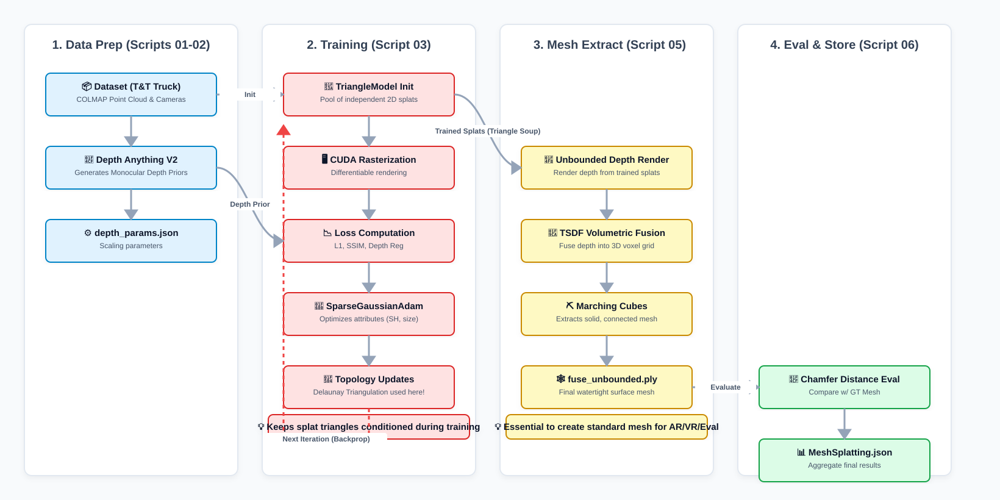

# Baseline MeshSplatting Metrics — Tanks & Temples Benchmark

**Status**: Baseline Execution & Benchmarking across 6 Scenes  
**Goal**: Establish a fully-instrumented baseline benchmark of MeshSplatting on the Tanks & Temples dataset (Barn, Caterpillar, Courthouse, Ignatius, Meeting_room, Truck) at 30,000 iterations. This establishes the definitive ground truth reference for all subsequent pruning and efficiency research.

---

## 📊 Comprehensive Scene-by-Scene Status Matrix

| Scene | Training (30k) | Image Metrics (PSNR/SSIM/LPIPS) | Native Mesh (.ply) | T&T Surface Eval (F-Score) | Trajectory Video (.mp4) | 5-View Progress Videos | Central JSON & WandB |
| :--- | :---: | :---: | :---: | :---: | :---: | :---: | :---: |
| **Barn** | ✅ Done | ✅ Done | ✅ Done | ✅ Done | ❌ **Pending** | ✅ Done | ❌ **Pending** |
| **Caterpillar** | ✅ Done | ✅ Done | ✅ Done | ✅ Done | ❌ **Pending** | ❌ **Pending** | ❌ **Pending** |
| **Courthouse** | ⚠️ Corrupted | ⚠️ Invalid | ⚠️ Degenerate | ❌ Blocked | ❌ Blocked | ❌ Blocked | ❌ Blocked |
| **Ignatius** | ✅ Done | ✅ Done | ✅ Done | ✅ Done | ✅ Done | ❌ **Pending** | ❌ **Pending** |
| **Meeting_room** | ✅ Done | ✅ Done | ✅ Done | ✅ Done | ✅ Done | ❌ **Pending** | ❌ **Pending** |
| **Truck** | ✅ Done | ✅ Done | ✅ Done | ✅ Done | ✅ Done | ❌ **Pending** | ❌ **Pending** |

---

## 📈 Quantitative Baseline Results Summary

| Scene | PSNR (↑) | SSIM (↑) | LPIPS (↓) | F-Score (↑) | Precision | Recall | Tau | Mesh Vertices | Mesh Faces | Size (MB) |
| :--- | :---: | :---: | :---: | :---: | :---: | :---: | :---: | :---: | :---: | :---: |
| **Barn** | 22.14 | 0.6806 | 0.3830 | **0.0037** | 0.0055 | 0.0028 | 0.010 | 2,736,849 | 4,757,839 | 101 MB |
| **Caterpillar** | 18.62 | 0.5558 | 0.4611 | **0.0236** | 0.0357 | 0.0176 | 0.005 | 2,864,929 | 4,491,002 | 100 MB |
| **Courthouse** | *4.67* | *0.1119* | *0.6365* | *Invalid* | *Invalid* | *Invalid* | — | *6,855* | *6,974* | *1 MB* |
| **Ignatius** | 18.30 | 0.5460 | 0.4303 | **0.0111** | 0.0349 | 0.0066 | 0.003 | 2,904,967 | 4,221,360 | 97 MB |
| **Meeting_room** | 20.18 | 0.7325 | 0.4108 | **0.0241** | 0.0243 | 0.0240 | 0.010 | 2,911,266 | 5,805,545 | 117 MB |
| **Truck** | 20.38 | 0.6865 | 0.3752 | **0.0945** | 0.1414 | 0.0709 | 0.005 | 2,958,775 | 4,577,271 | 102 MB |

---

## 📋 Prioritized ToDo List & Action Items

### 🟢 Priority 1: Compute Missing T&T Surface Metrics for Barn & Caterpillar
- **What**: During Run 1, the T&T surface evaluation step was skipped due to a path mismatch that has since been fixed. The native meshes already exist, so no retraining is needed.
- **Runnable Commands**:
  ```bash
  cd /data1/hemanth/mesh-splatting/my_expts/baseline_mesh_splatting_metrics
  bash 06_b_eval_tandt.sh Barn 30000
  bash 06_b_eval_tandt.sh Caterpillar 30000
  ```

---

### 🟡 Priority 2: Generate 5-View Progress Videos for Remaining Scenes
- **What**: Progress videos with the top milestone progress bar (0–30k) have been generated for `Barn_baseline`. The remaining scenes (`Caterpillar`, `Ignatius`, `Meeting_room`, `Truck`) still need their 5 view progress MP4s rendered.
- **Runnable Command**:
  ```bash
  cd /data1/hemanth/mesh-splatting
  python my_expts/baseline_mesh_splatting_metrics/create_progress_videos.py \
      --path my_expts/baseline_mesh_splatting_metrics/output \
      --fps 10
  ```

---

### 🟡 Priority 3: Render Trajectory Camera Videos for Barn & Caterpillar
- **What**: In Run 1, the rendered trajectory videos for Barn and Caterpillar were saved to the repository root directory instead of the respective scene output folders. Render them directly into their output folders:
- **Runnable Commands**:
  ```bash
  cd /data1/hemanth/mesh-splatting/my_expts/baseline_mesh_splatting_metrics
  bash 07_create_video.sh Barn 30000
  bash 07_create_video.sh Caterpillar 30000
  ```

---

### 🔵 Priority 4: Aggregate All Results to Central JSON & Sync WandB Run Summaries
- **What**: Run the rewritten scene-aware `store_results.py` to auto-discover all scenes, aggregate image and geometric metrics into `/data1/hemanth/results/papers/MeshSplatting.json`, and resume WandB runs via `wandb_id.txt` to populate `eval/tnt_f_score`, `eval/tnt_precision`, `eval/tnt_recall`, and mesh stats.
- **Runnable Command**:
  ```bash
  cd /data1/hemanth/mesh-splatting
  python my_expts/baseline_mesh_splatting_metrics/store_results.py
  ```

---

### ⚪ Priority 5: Fix Courthouse Dataset & Retrain Baseline (Backlog)
- **What**: The COLMAP reconstruction in `/data1/hemanth/datasets/tandt/Courthouse` only registered 2 cameras (1 train, 1 test), causing training collapse.
- **Action**:
  1. Inspect and re-extract COLMAP sparse points/cameras for Courthouse.
  2. Once the dataset contains proper multi-view cameras, execute:
  ```bash
  cd /data1/hemanth/mesh-splatting/my_expts/baseline_mesh_splatting_metrics
  ./run_experiment.sh Courthouse
  ```

---

## 🏛️ Architecture & Pipeline Overview

<div align="center">
  
</div>

### The "Delaunay vs TSDF" Distinction

The core novelty of MeshSplatting is creating an opaque, connected mesh directly during training:

1. **Training & Native Output (`train.py`)**
   - **Stage 1 (Iter 0–11k)**: Initializes independent, semi-transparent triangle splats (Triangle Soup). Employs MCMC densification and opacity-based pruning.
   - **Stage 2 (Iter 11k)**: Executes **Restricted Delaunay Triangulation (`effrdel`)** to physically merge vertices and establish topology.
   - **Stage 3 (Iter 11k–30k)**: Fine-tunes the connected mesh, driving opacities strictly to 1.0 via a scheduled sigmoid.
   - **Output**: `native_mesh_30000.ply` is exported via `create_ply.py`. This is a game-engine-ready opaque mesh (Unity/Unreal).

2. **Surface Evaluation Pathway**
   - In academic benchmarks on DTU, TSDF volumetric fusion (`mesh.py`) is often used as a fallback for watertight requirements.
   - For this Tanks & Temples baseline, the **native mesh** (`native_mesh_30000.ply`) is evaluated directly by sampling 10 million surface points and running official ICP alignment against the LiDAR ground truth scan (`<Scene>.ply`).

---

## ⚙️ Phase Execution Reference

- **Phase 1: Data Preparation & Depth Priors** (`01_download_tandt.sh`, `02_generate_depth.sh`): Loads COLMAP cameras, images, and Depth Anything V2 priors.
- **Phase 2: Training** (`03_train.sh`): 30,000 iterations using L1, SSIM, `vertex_depth_loss_hr`, and normal consistency.
- **Phase 3: Image Metrics** (`04_render_metrics.sh`): Novel view rendering and PSNR/SSIM/LPIPS computation on held-out test views.
- **Phase 4: Native Mesh Extraction** (`06_extract_native.sh`): Opacity threshold pruning and standard PLY mesh export.
- **Phase 5: Tanks & Temples Surface Evaluation** (`06_b_eval_tandt.sh`): ICP point cloud registration against LiDAR scan to measure F-score, Precision, and Recall.
- **Phase 6: Trajectory Video Creation** (`07_create_video.sh`): 1200-frame continuous camera path trajectory render.
- **Phase 7: Central Storage & WandB Logging** (`store_results.py`): Uploads complete metrics table to WandB run summaries and records JSON entry.
